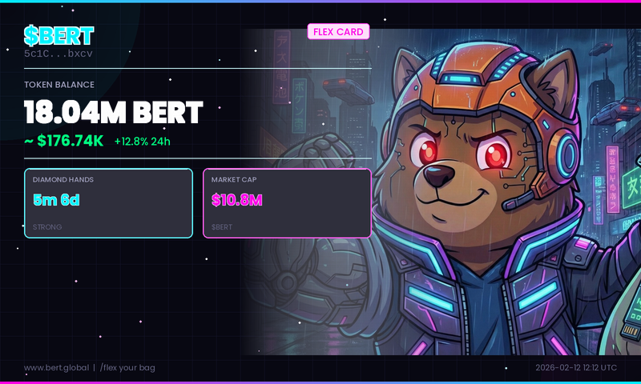

# 🐶 $BERT Portfolio Flex Bot

A Telegram bot that generates **cyberpunk-styled portfolio flex cards** for $BERT (Bertram The Pomeranian) holders on Solana.

Members type `/flex <wallet>` and get a shareable card showing their bag size, USD value, diamond hands duration, and holder rank.



## Features

- 🎨 **Cyberpunk flex card** — Dark, neon-styled shareable image
- 💰 **Live balance + USD** — Real-time from Solana RPC + DexScreener
- 💎 **Diamond hands tracker** — Shows how long a wallet has held $BERT
- 🏆 **Holder rank** — Rank among top holders with tier badges (Whale/Shark/Dolphin/Fish)
- 📊 **Price command** — Quick `/price` for current market data
- ⚡ **Rate limiting** — Prevents spam (15s cooldown per wallet)

## Quick Setup (5 minutes)

### 1. Create Your Telegram Bot

1. Open Telegram and message [@BotFather](https://t.me/BotFather)
2. Send `/newbot` and follow the prompts
3. Choose a name like `BERT Flex Bot`
4. Choose a username like `bert_flex_bot`
5. Copy the **bot token** you receive

### 2. Install & Configure

```bash
# Clone / download this folder
cd bert-flex-bot

# Install dependencies
pip install -r requirements.txt

# Create .env from template
cp .env.example .env

# Edit .env and paste your bot token
nano .env
```

### 3. Run the Bot

```bash
python bot.py
```

### 4. Add to Your Telegram Group

1. Open your Telegram group
2. Add the bot by searching its username
3. Make it an admin (so it can send photos)
4. Members can now type `/flex <wallet_address>`

## Commands

| Command | Description |
|---------|-------------|
| `/start` | Welcome message with instructions |
| `/flex <wallet>` | Generate a flex card for a Solana wallet |
| `/price` | Show current $BERT price and market data |

## Hosting (Keep It Running 24/7)

### Option A: Railway (Easiest)
1. Push to GitHub
2. Connect at [railway.app](https://railway.app)
3. Add `TELEGRAM_BOT_TOKEN` as environment variable
4. Deploy — done!

### Option B: Any VPS
```bash
# Using screen to keep it running
screen -S bert-bot
python bot.py
# Press Ctrl+A then D to detach
```

### Option C: Docker
```dockerfile
FROM python:3.11-slim
WORKDIR /app
COPY . .
RUN pip install -r requirements.txt
CMD ["python", "bot.py"]
```

## Recommended: Premium Solana RPC

The free Solana RPC has rate limits. For a busy group, use a premium RPC:

- **[Helius](https://helius.dev)** — Free tier: 10 RPS (recommended)
- **[QuickNode](https://quicknode.com)** — Free tier available
- **[Alchemy](https://alchemy.com)** — Free tier available

Set your RPC URL in `.env`:
```
SOLANA_RPC_URL=https://mainnet.helius-rpc.com/?api-key=YOUR_KEY
```

## Customization

### Change the token
Edit `config.py` to update `TOKEN_MINT`, `TOKEN_TICKER`, and `TOKEN_NAME`.

### Change the card style
Edit `card_generator.py` — the color scheme, layout, and effects are all customizable. Key variables:
- `CYAN`, `MAGENTA`, `GOLD` — neon accent colors
- `CARD_WIDTH`, `CARD_HEIGHT` — card dimensions
- `_draw_scanlines()` — CRT effect intensity
- `_draw_particles()` — floating particle count

### Add features
Some ideas to extend the bot:
- **Leaderboard** (`/top`) — Show top 10 holders in the group
- **Alerts** — Post when someone makes a big buy
- **Twitter/X sharing** — Add a "Share on X" button
- **Custom backgrounds** — Let holders upload their own bg

## Architecture

```
bert-flex-bot/
├── bot.py              # Telegram bot (commands, handlers)
├── solana_client.py    # Solana RPC + DexScreener API calls
├── card_generator.py   # Pillow-based image generation
├── config.py           # Token config, colors, API endpoints
├── requirements.txt    # Python dependencies
├── .env.example        # Environment template
└── README.md           # This file
```

## API Dependencies

- **Solana JSON-RPC** — Token balances, holder data, transaction history
- **DexScreener API** — Price, market cap, volume (free, no key needed)
- **Telegram Bot API** — Message handling, photo sending

## License

MIT — Use it for any token, modify freely.
